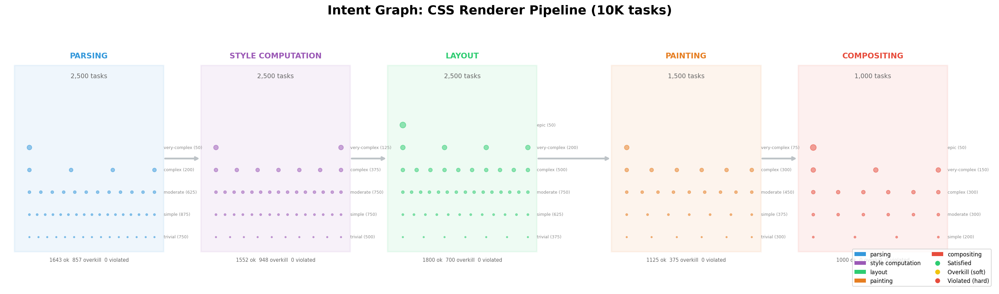

# Intent IDE

An experimental IDE where **intents replace files** as the primary unit of work. You navigate a directed graph of 10,000 tasks, adjust constraint sliders (cost, quality, deadlines), and a CP-SAT solver routes work across 300 heterogeneous AI agents in real time.

Code is the exhaust. The constraint surface is the interface.



## The Idea

Traditional IDEs organize around files. Intent IDE organizes around **what the system should do**:

- **Intent Canvas** — A zoomable DAG of tasks colored by status (green = satisfied, yellow = overkill, red = violated)
- **Constraint Panel** — Sliders for quality floor, budget cap, overkill tolerance, deadline compliance. Move a slider, the solver re-runs, the canvas updates.
- **Agent Roster** — 300 agents (Claude, GPT-5.2, Gemini, Llama, etc.) with live utilization, quality scores, and cost rates
- **Economics Dashboard** — Total spend, $/story-point, agent utilization, constraint violations
- **Wave Diff Panel** — Mass diff view for Conductor-era code review with semantic diffs, constraint impact tables, and impact heatmaps

The solver minimizes cost while satisfying: every task assigned exactly once, no agent over capacity, quality floors met, dependencies respected.

See [docs/intent-ide-2030.md](docs/intent-ide-2030.md) for the full vision.

## Running the Intent IDE

```bash
# Backend (Flask + WebSocket)
source .venv/bin/activate
pip install -e .
python -m src.intent_ide.app

# Frontend (React + React Flow + Bun) — in a separate terminal
cd frontend
bun install
bun dev  # dev server on :3000
```

Then open http://localhost:3000

## Project Structure

```
src/
├── intent_ide/           # Intent IDE web app
│   ├── app.py            # Flask backend + WebSocket APIs
│   ├── graph_data.py     # Intent graph → React Flow nodes/edges
│   └── solver_worker.py  # Background CP-SAT solver with constraint updates
│
├── quantum_routing/      # Solver backend (shared with notebooks)
│   ├── css_renderer_config.py    # Hyperparameters, cost weights
│   ├── css_renderer_agents.py    # Agent pool (300 agents)
│   ├── css_renderer_intents.py   # Intent generation (10K tasks)
│   ├── solve_10k_ortools.py      # CP-SAT solver
│   ├── github_tickets.py         # GitHub issues integration
│   └── telemetry.py               # Metrics computation
│
frontend/                 # React + TypeScript + Tailwind
├── src/
│   ├── components/       # IntentCanvas, ConstraintPanel, WaveDiffPanel
│   │   └── wave-diff/    # SemanticDiff, ConstraintHUD, ImpactHeatmap
│   ├── store.ts          # Zustand state (constraints, assignments)
│   └── types.ts          # Intent, Agent, Status, WaveData types

notebooks/                # Jupyter notebooks for exploration
├── quantum-routing-10k.ipynb    # 10K intent simulation

docs/                     # Design documents
├── intent-ide-2030.md    # Vision doc
├── nextsteps.md          # Roadmap
└── AGENT_PROFILES_WORKFLOWS.md  # Agent behavior specifications
```

## Features

### Wave Diff Panel (Mock UI)

A 3-pane interface for mass diff review:

- **Left: Intent Sidebar** — Work organized by Agent + Intent rather than by file
- **Center: Semantic Diff** — Logic summary at 3 granularity levels (Intent → Architecture → Code)
- **Right: Constraint HUD** — Before/after metrics comparison (latency, cost, coverage)
- **Impact Heatmap** — Risk predictions for each changed file

### GitHub Integration

Fetch and decompose GitHub issues into intents:

```bash
# Set repo in Settings modal (e.g., facebook/react)
# Issues are automatically fetched and decomposed
```

## The Solver

Given N intents and M agents, the solver finds assignments minimizing:

```
cost = Σ (token_cost + overkill_penalty + latency_cost + deadline_penalty)
```

Subject to:
- Each intent assigned to exactly one agent
- No agent exceeds capacity
- Agent quality ≥ intent quality floor
- Dependencies: upstream completes before downstream

**Overkill penalty**: Using a $0.005/token agent for a task that only needs $0.001/token quality wastes money. The solver penalizes quality surplus to push cheap tasks toward cheap agents.

The solver uses Google OR-Tools CP-SAT (scales to 10K+ tasks). D-Wave quantum annealing is available for smaller problems via the notebooks.

## Agent Pool (300 Agents)

| Type | Models | Sessions | Capacity | Total Slots |
|------|--------|----------|----------|-------------|
| Cloud | claude, gpt5.2, gemini, kimi2.5 | 60 each | 50 | 12,000 |
| Local | llama, mistral, codellama, qwen2 | 10 each | 6–10 | 420 |

## Intent Backlog (10,000 Tasks)

Distributed across a 5-stage CSS Renderer pipeline (Parsing → Style → Layout → Paint → Composite):

| Tier | Count | Tokens | Quality Floor |
|------|-------|--------|---------------|
| trivial | 1,925 | 500 | 0.50 |
| simple | 2,825 | 1,500 | 0.60 |
| moderate | 2,875 | 5,000 | 0.75 |
| complex | 1,675 | 12,000 | 0.85 |
| very-complex | 600 | 25,000 | 0.90 |
| epic | 100 | 60,000 | 0.95 |

## Dependencies

- `ortools` — Google CP-SAT solver
- `flask`, `flask-socketio` — Backend
- `numpy`, `matplotlib` — Data/visualization
- `dwave-ocean-sdk` — Optional quantum annealing

Python 3.13, Node 18+, Bun 1.0+.
