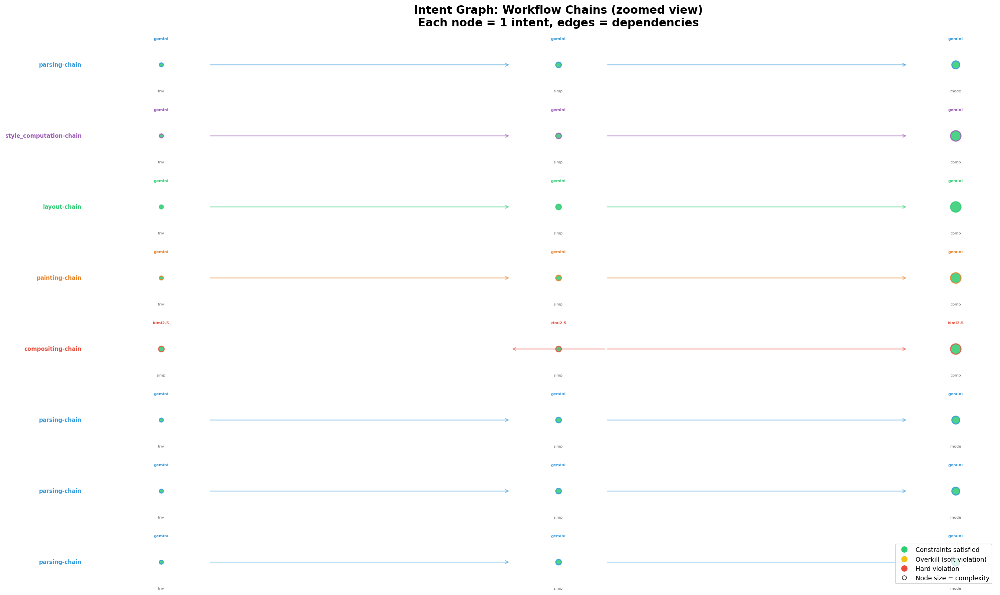
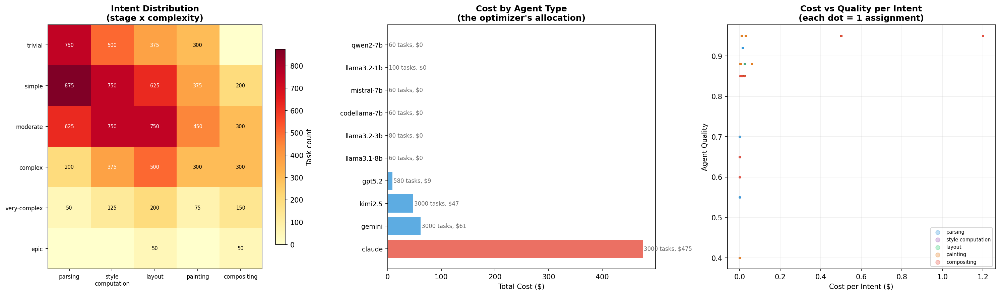

# The Intent IDE: Software Development in 2030

## The Death of the File Tree

The file tree is gone. Not hidden — gone. Code still exists as text in files on disk, the way assembly still exists beneath your Python. But no one navigates by it. The organizing metaphor of the IDE is no longer "files in directories." It is **intents and their constraint surfaces**.

When you open a project, you don't see `src/`. You see a directed graph of intents — what the system is supposed to do, decomposed to whatever depth has been specified. Each node is an intent. Edges are dependencies. Color is status. The codebase is a derived artifact of this graph, not the other way around.

## What You See When You Open the IDE

### The Intent Canvas (center)


*The macro view. Five pipeline stages, 10K intents, colored by complexity tier. Arrows are dependency edges between stages. Status counts at the bottom: zero hard violations, overkill concentrated where cheap tasks spill onto expensive agents.*

A zoomable, pannable directed acyclic graph. Each node is an intent — a unit of work described in natural language with structured metadata: complexity tier, quality floor, estimated tokens, deadline, dependency edges.

At the highest zoom level, you see epics. Zoom in and they decompose into sub-intents, then leaf intents. The decomposition tree is the primary navigation structure. You don't "go to file." You go to intent. The code that fulfills an intent is attached to the intent node, not to a location in a directory tree.

Nodes are colored by status:
- **White**: specified but not yet assigned
- **Blue**: assigned to an agent, execution pending
- **Green**: executed, all constraints satisfied
- **Yellow**: executed, soft constraint violations (overkill, suboptimal cost)
- **Red**: executed, hard constraint violation (test failure, type error, intent misalignment)
- **Gray**: pruned or deferred by the planner

Edges are colored by dependency health:
- **Solid gray**: dependency satisfied, no issues
- **Dashed red**: dependency violated (downstream started before upstream completed, or quality degradation across the edge)


*The zoomed view. Each node is one intent. Node size is complexity. Color is constraint status (green = satisfied, yellow = overkill). Agent name above, complexity below. Dependency arrows connect the chain. This is the primary navigation surface.*

Click any node. It expands to show:
- The intent description (natural language + structured fields)
- The assigned agent and why it was chosen (cost, quality score, capability match)
- The produced artifact (code, config, documentation — whatever the intent called for)
- Constraint satisfaction: a per-constraint checklist (types pass, tests pass, intent alignment score, cost within budget)
- Review status and history

### The Constraint Panel (right)

A vertical stack of adjustable constraints, each with a slider, a current value, and a violation count.

**Hard constraints** (binary — satisfied or not):
- All tests pass: 9,847 / 10,000 (153 red)
- All types resolve: 10,000 / 10,000
- All imports resolve: 10,000 / 10,000
- Zero dependency ordering violations: 0 violations
- No agent over capacity: 0 violations

**Soft constraints** (continuous — sliders with thresholds):
- Quality floor: 0.85 [slider] — 240 assignments below threshold at 0.90
- Budget cap: $600 [slider] — current spend $592, headroom $8
- Overkill tolerance: 15% [slider] — currently 28.8% of cheap tasks on expensive agents
- Deadline compliance: 95% [slider] — currently 97.2% on time
- Context affinity: 60% [slider] — currently 71% of dependent tasks share agent type

Move a slider. The solver runs. The canvas updates. Nodes change color. The cost counter ticks up or down. This is the core interaction loop: **adjust constraints, observe the feasibility surface, decide what tradeoffs to accept**.


*The constraint surface. Left: intent distribution heatmap (stage x complexity). Center: cost allocation by agent type — Claude absorbs 80% of spend. Right: cost vs quality per assignment — the Pareto frontier the sliders navigate.*

The constraint panel also shows **Pareto frontiers** — when two constraints trade off against each other (cost vs quality, speed vs thoroughness), the panel shows the efficient frontier and where your current settings sit on it. You can drag your position along the frontier instead of adjusting individual sliders.

### The Violations Dashboard (bottom)

Four rows, always visible, showing real-time constraint health across the four verification layers:

**Layer 1 — Static** (types, imports, syntax)
Fully automated, sub-second. Shows count of violations, each expandable to the specific intent and the specific error. These are rarely non-zero because the agent producing code has access to the same type checker. When they appear, it's usually a cross-intent integration issue.

**Layer 2 — Dynamic** (tests, runtime behavior)
Automated but slower. Tests run continuously in the background as agents produce code. Each intent has associated test expectations (generated from the intent description or hand-specified). Failures show the intent, the test, the expected vs actual behavior.

**Layer 3 — Heuristic** (intent alignment)
An LLM reviews each agent's output against the original intent description. Produces a confidence score (0-1) and a list of gaps: "Intent asked for error handling on network timeout, output only handles connection refused." This is the approximate oracle — not proof, but good enough to flag misalignment for human review.

The confidence threshold is itself a constraint slider. Set it to 0.9 and most things pass. Set it to 0.95 and you get more flags to review but catch more subtle misalignment.

**Layer 4 — Economic** (cost, throughput, utilization)
The shift report, live. Total spend, cost per story point, agent utilization, capacity headroom. This is where the CP-SAT model outputs surface. The solver's objective function value is displayed as a single number that goes up or down as you adjust constraints.

### The Agent Roster (left panel, collapsible)

Not a file explorer. A list of available agents with live stats:
- Name, model type, quality score, token rate
- Current load / capacity
- Historical performance: what task types it excels at, where it fails
- Effective quality by complexity tier (learned from review feedback, not just the static spec)

Quality scores update over time as review results feed back. An agent that consistently fails intent alignment on "complex" tasks sees its effective quality drop for that tier, and the solver routes fewer complex tasks to it. No human has to update a config. The constraint surface evolves with evidence.

## The Workflow

### 1. Specify

You write an epic intent in natural language with structured metadata. Or you speak it. Or you paste a Slack thread and the system extracts the intent. The input format doesn't matter — the system normalizes it into the intent schema: description, complexity estimate, quality floor, dependencies, deadline.

The system proposes a decomposition. You see it as a subtree appearing under your epic on the canvas. Each leaf intent is scoped to a single agent's capability. The planning tax is displayed: "Decomposing this epic into 47 leaves will cost 12,400 tokens in planning overhead. Estimated total: 89,000 tokens, $4.20."

You adjust the decomposition. Drag a branch to merge two leaves that are too granular. Split a leaf that's too broad. Add a dependency edge between two intents that the system missed. The system re-estimates costs in real time.

### 2. Assign

Hit "Route." The solver runs. Assignments appear as edges from intents to agents on the canvas. The cost counter updates. Violations appear (or don't). You review the assignment map:

- Are expensive agents handling cheap tasks? (overkill indicator)
- Are any agents over capacity? (capacity indicator)
- Are dependency chains assigned to the same agent type? (affinity indicator)
- Is the total cost within budget? (economic indicator)

If something looks wrong, adjust a constraint and re-solve. Or pin a specific assignment ("this intent must go to Claude") and let the solver work around it.

### 3. Execute

Agents begin producing artifacts. The canvas updates in real time. Nodes transition from blue (assigned) to green (complete) or red (violation). You watch the wavefront of execution move through the dependency graph — upstream intents complete first, unlocking downstream work.

You don't watch individual agents type code. You watch intents turn green.

### 4. Review

The four-layer verification runs continuously:
- Static checks catch type and import errors immediately
- Tests run as artifacts land
- The intent alignment oracle scores each output
- The economic layer updates cost actuals vs estimates

You open the violations dashboard. Sort by severity. The top violation is: "Intent `layout-flexbox-gap-handling` scored 0.72 on intent alignment. Gap: intent specified percentage-based gaps, output only handles pixel values." You click it. The intent and the code appear side by side. You decide: is this a real problem or is the oracle being picky?

If it's real, you can:
- **Reject and reassign** — send back to the same agent with the gap noted, or reassign to a higher-quality agent
- **Tighten the constraint** — raise the quality floor for layout intents so the solver picks better agents next time
- **Edit the intent** — maybe percentage-based gaps were aspirational, not required. Loosen the intent and mark satisfied.

If the oracle is wrong, you mark the review as "approved despite low score." This feedback trains the oracle's calibration for future reviews.

### 5. Close the Loop

Review outcomes feed back into three places:

**Agent quality model** — each agent's effective quality score per complexity tier adjusts based on review history. An agent that passes 95% of intent alignment reviews on "moderate" tasks has a high effective quality for moderate work. One that fails 30% of "complex" reviews gets downgraded. The solver learns where to route.

**Decomposition heuristics** — if leaf intents from a certain decomposition pattern consistently fail review, the decomposer learns to split differently. Intents that were scoped too broadly (high failure rate) get flagged for finer decomposition next time.

**Constraint defaults** — over time, the system learns your project's natural constraint surface. Quality floor defaults to 0.92 because that's where you always end up setting it. Budget tolerance defaults to 10% headroom because you consistently reject tighter fits. The IDE adapts to your judgment patterns.

## What's Not On Screen

**File trees.** The file system is an implementation detail. Code is organized by intent, not by directory convention.

**Syntax highlighting as the primary visual.** Code appears when you drill into a specific intent's artifact. It's syntax highlighted, sure. But it's not the thing you're staring at. The intent graph and the constraint panel are.

**Terminal output as the primary feedback.** Test results, build status, deployment state — all surfaced as constraint satisfaction indicators on the dashboard. You never `cd` and `npm test`. The system runs verification continuously and shows results as colors on the canvas.

**Manual git operations.** Each intent completion is an atomic unit of work. The system handles versioning at the intent level. "Roll back this intent" undoes the agent's artifact and reassigns. You don't think in commits, you think in intent state transitions: specified, assigned, executed, reviewed, accepted.

## The Economics Display

A persistent widget showing the project's economic state — the thing your shift report showed, but live:

```
Total intents:     10,000    Budget:    $600.00
Completed:          9,847    Spent:     $571.88
In progress:          112    Remaining: $ 28.12
Blocked:               41    $/SP:      $0.0189
─────────────────────────────────────────────────
Agent utilization:  78.4%    Overkill:     14.2%
Local (free):        420     Dep violations:   0
Cloud (paid):      9,427     Quality met:  99.2%
```

This is always visible. It's the scorecard. Every constraint adjustment, every agent assignment, every review outcome moves these numbers. The IDE is a dashboard for managing the economics of automated software production.

## What the Engineer's Job Becomes

You don't write code. You:

1. **Specify intents** — describe what the system should do, at the right granularity
2. **Set constraints** — define quality, cost, and correctness thresholds
3. **Review violations** — inspect the places where automated verification flagged problems
4. **Adjust the constraint surface** — tighten where quality is insufficient, loosen where cost is prohibitive
5. **Make judgment calls** — the things the solver can't decide: is this tradeoff acceptable? Is this intent well-scoped? Is this agent's output good enough?

The IDE is the instrument panel for this work. Code is the exhaust.
